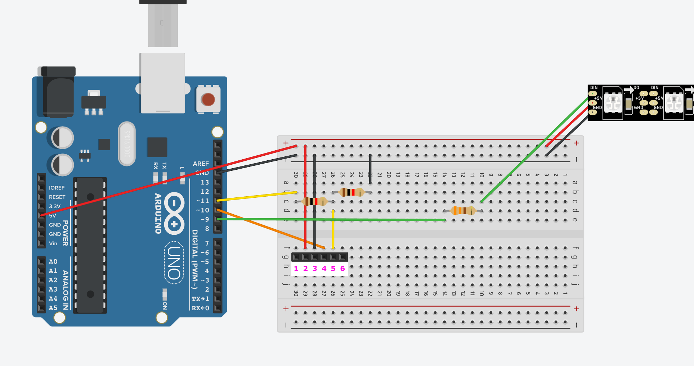

# Lumos arduino

Arduino part of the Lumos LED stripe project, a unique and beautiful DIY Bluethooth-controlled room ambient light based on the WS2812B addressable LED stripe and HC-06 UART Bluetooth module.

| | | |
|-|-|-|
|  |  |  |

## Essential hardware
* Arduino Nano, Uno or Leonardo with an ATmega328P or ATmega32U4 microcontroller.
* WS2812B addressable LED stripe (any type, length, and LED count).
* HC-06 UART Bluetooth module.
* Power supply on 5V and 3.2A or analog.
* Resistors of 1 kΩ ± 5% (2 pcs).
* Resistors of 220 Ω ± 5% (2 pcs) or alternatively, 1 pcs 330 Ω ± 5% resistor.
* Breadboard.
* A bunch of jumper wires.

## Device design


> **Note** <br/>
> Since there are no available Bluetooth modules in the [Tinkercad](https://www.tinkercad.com/) component palette, it was replaced with a 6-pin substitute component. <br/><br/>
Pins we are interested in:<br/>
>```
> VCC(2), GND(3), TXD(4), RXD(5)
>```
>And here is what the actual HC-06 Bluetooth module looks like:<br/>


This design scheme is suitable for LED stripes consisting of 30 or fewer LEDs.
The reason for that is power consumption. One WS2812B LED consumes approximately 0.06 A at maximum brightness. And we can't power many stripe LEDs this way because it could potentially cause system instability or even damage. So, assembling your device this way is only recommended for a few LEDs (up to 30).

## Precompile configuration

> **Note**<br/>
To be able to compile and use this sketch, you should install the [FastLED](https://github.com/FastLED/FastLED) arduino library.

This line allows us to enable or disable debug mode to see (or not see XD) data transfer communications. (Set it to 1 to enable and 0 to disable.)

```c++
#define LUMOS_DEBUG    0
```

Then we have the **LED_COUNT** parameter, which defines how many LEDs our stripe has. Put your amount here. The **LED_PIN** parameter points to an arduino pin that will send commands to the LED stripe. This pin is wired to the stripe's **DIN**.

```c++
#define LED_COUNT    60
#define LED_PIN       7
```

Since we are using two-dimensional Perlin noise, we should move around the generated values with some step size. You can put yours here. You can play with the values, but the default 15 is an optimal one.

```c++
#define COLOR_SHIFT_STEP    15
```

The next bunch of settings defines how much components like **Hue**, **Saturation** and **Value** should bend around some base value, creating a realistic fire effect.

```c++
#define HUE_DEVIATION                  21
#define MIN_SATURATION_DEVIATION      245
#define MAX_SATURATION_DEVIATION      255
#define MIN_VALUE_DEVIATION            70
#define MAX_VALUE_DEVIATION           200
```

Here we have Bluetooth data transfer pins to define. Look carefully at how you connected your HC-06 module data lines (RXD and TXD) and provide the correct Arduino pins. <br/>
For instance, if you connect your HC-06 **RXD** pin to the Arduino's 10th pin and your **TXD** pin to the Arduino's 11th pin, then the setup will look like this:

```c++
#define BT_RX_PIN    10
#define BT_TX_PIN    11
```
